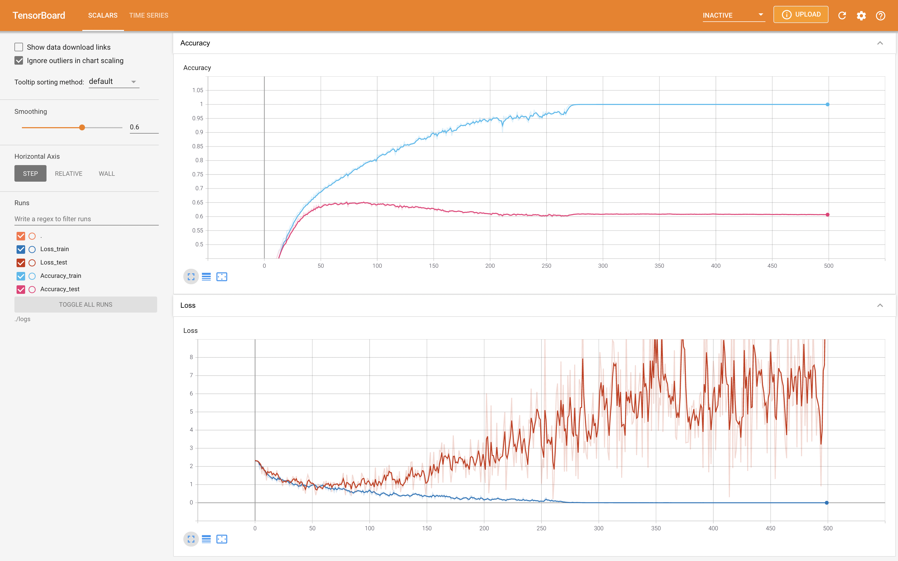

# LeNet
- 畳み込みニューラルネットワークの基礎としてLeNetをPytorchで実装してみた．
- 主にPytorchとTensorboardの使い方が目標．
- [こちらのサイト](https://rightcode.co.jp/blog/information-technology/pytorch-cifar-10-cnn-learning)を参考にした．
- このサイトではMatplotlibでグラフを描画していたのでそこをTensorboardで表示できるようにした．
- Tensorboardによって表示されるLossとAccuracyはこんなかんじ

- エポック数が多くなるにつれてTest lossが上がり，過学習していることが確認できる．

